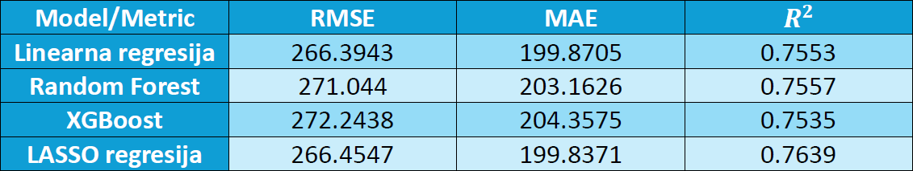

# All Computer Prices – Analiza i predikcija cena računara i laptopova

## Opis projekta

Ovaj projekat predstavlja detaljnu obradu i analizu velikog skupa podataka o računarima i laptopovima u cilju **predikcije cene uređaja**.

Korišćen je **skup podataka sa Kaggle-a** koji sadrži **100.000 uređaja**, sa **33 atributa** koji pokrivaju sve relevantne tehničke karakteristike, kao i ciljni atribut `price`.

---

## Ciljevi

- Primeniti različite pristupe pripremi, vizualizaciji i modelovanju podataka u jeziku R
- Utvrditi koja obeležja najviše doprinose ceni
- Izgraditi precizan model za predviđanje cene uređaja

---

## Struktura rada

1. Uvod  
2. Opis skupa podataka  
3. Čišćenje i obrada podataka
4. Istraživačka analiza (EDA)    
5. Feature engineering  
6. Treniranje modela  
7. Poređenje modela  
8. Zaključak  

---

## Opis skupa podataka

- **Izvor**: Kaggle  
- **Ukupan broj redova**: 100.000  
- **Broj kolona**: 33  
- **Ciljna promenljiva**: `price` (USD)  

Ovaj skup podataka sadrži tehničke specifikacije računara i laptopova, uključujući informacije o procesoru, grafičkoj kartici, memoriji, ekranu, operativnom sistemu i dodatnim karakteristikama uređaja.

### Primeri atributa:

- **Tip uređaja**: `device_type`, `brand`, `model`, `release_year`
- **CPU**: `cpu_model`, `cpu_cores`, `cpu_threads`, `cpu_base_ghz`, `cpu_boost_ghz`, `cpu_tier`
- **GPU**: `gpu_model`, `vram_gb`, `gpu_tier`
- **RAM i skladište**: `ram_gb`, `storage_type`, `storage_gb`
- **Ekran**: `display_size_in`, `resolution`, `refresh_hz`, `display_type`
- **Napajanje**: `battery_wh`, `charger_watts`, `psu_watts`
- **Ostalo**: `os`, `wifi`, `bluetooth`, `weight_kg`, `warranty_months`
- **Ciljna vrednost**: `price` – tržišna cena uređaja u američkim dolarima

Podaci su heterogeni: obuhvataju kako desktop računare, tako i laptopove iz različitih cenovnih klasa, proizvođača i operativnih sistema (Windows, macOS, Linux, ChromeOS).

---

### Univarijantna analiza

U univarijantnoj analizi fokus je bio na ispitivanju **raspodele pojedinačnih promenljivih** iz skupa podataka, kako bi se stekao osnovni uvid u karakteristike uređaja.

### Ciljevi analize:
- Identifikovati dominantne vrednosti i ekstreme u atributima
- Uočiti distribuciju promenljivih

---

### Bivarijantna analiza

U ovoj fazi analizirana je povezanost između **nekih pojedinačnih osobina i ciljne vrednosti `price`**, sa ciljem da se utvrdi koliko jaka je veza između njih.

### Ciljevi analize:
- Oceniti kako pojedinačni atributi utiču na cenu
- Identifikovati linearnost, stepen korelacije i grupne razlike
- Otkriti koji prediktori imaju najjači individualni uticaj

---

### Multivarijantna analiza

Nakon univarijantne i bivarijantne analize, sprovedena je i **multivarijantna analiza** sa ciljem da se uoče **kompleksne međuzavisnosti između više osobina** koje zajedno utiču na cenu uređaja.

### Ciljevi analize:
- Prepoznati kombinacije osobina koje istovremeno utiču na `price`
- Ispitati interakcije između CPU, GPU, RAM i drugih komponenti

---

## Čišćenje podataka

Pre izgradnje modela, bilo je neophodno detaljno očistiti i pripremiti podatke. Skup podataka je u početku sadržao mnoge nepravilnosti i nerealne vrednosti koje bi negativno uticale na performanse modela.

### Koraci čišćenja:

- **Uklanjanje nelogičnih kombinacija:**
  - Proizvođači i operativni sistemi koji nisu međusobno kompatibilni

- **Filtriranje outliera:**
  - Outlieri su identifikovani i kroz analizu distribucije i domensko znanje

Ovi koraci su odigrali ključnu ulogu u unapređenju preciznosti modela. Bez adekvatnog čišćenja, modeli bi bili podložni velikim greškama zbog ekstremnih vrednosti i nerealnih kombinacija karakteristika.

---

## EDA – Exploratory Data Analysis

Nakon čišćenja podataka sprovedena je detaljna istraživačka analiza radi boljeg razumevanja odnosa između ulaznih promenljivih i ciljne vrednosti (`price`).

### Matrica korelacije

Korišćena funkcija `ggcorrplot` za prikaz korelacija između numeričkih promenljivih.

Najjače korelacije sa `price` imaju:

- `ram_gb`
- `cpu_cores`
- `cpu_threads`
- `cpu_base_ghz`
- `cpu_boost_ghz`

Atributi poput `battery_wh`, `charger_watts`, `psu_watts`, `weight_kg` imaju slabiju korelaciju sa cenom.

Ova analiza je poslužila kao osnova za dalji inženjering osobina i odabir odgovarajućih modela.

---

## Feature Engineering

Na osnovu uvida iz EDA faze, izrađene su dodatna obeležja koje bolje opisuju sposobnosti uređaja i omogućavaju modelima da budu precizniji.

### Kreirane osobine:

- **`cpu_power_score`**  
  Računat kao:  
  `cpu_cores × cpu_base_ghz`  
  Predstavlja aproksimaciju ukupne snage CPU-a.

- **`cgt_score`**  
  Kombinovana metrika snage CPU i GPU:  
  `cpu_tier + gpu_tier`  
  Osmišljena da objedini ključne performanse sistema.

- **`cpu_generation`**  
  Ekstrahovana iz stringa `cpu_model`, koristi se kao ordinalni faktor. 

---

## ANOVA testovi

Kako bi se dodatno procenio značaj nekih kategorijskih prediktora u objašnjenju ciljne promenljive `price`, korišćeni su **ANOVA testovi (Analysis of Variance)**.

Ovi testovi omogućavaju uvid u to **da li postoje statistički značajne razlike u srednjim vrednostima cene** između grupa unutar pojedinih atributa.

### Testirani atributi:

- `cpu_tier`  
- `gpu_tier`  

### Rezultati:

| Atribut        | p-vrednost    | Zaključak                      |
|----------------|---------------|--------------------------------|
| `cpu_tier`     | < 0.05        | **Vrlo značajan uticaj**       |
| `gpu_tier`     | < 0.05        | **Vrlo značajan uticaj**       |

---

## Pregled modela i rezultata

Tokom projekta testirano je više različitih modela sa ciljem da se uporede njihove performanse u predikciji cene uređaja.

- Linearna regresija (12 modela)
- Random Forest
- XGBoost
- Lasso regresija

---

## Uporedna tabela modela

---

## Zaključak

- Rad pokazuje da se cena računara može uspešno predvideti kombinovanjem tehničkih parametara i nekoliko dodatnih indikatora kao što su brend i godina izdavanja. 
- Modeli su se pokazali dovoljno preciznim da se koriste za procenu cene uređaja. 
- Iako postoji prostor za dalja poboljšanja, ovaj projekat predstavlja kompletan i zaokružen primer primene metoda nauke o podacima na konkretan i praktičan problem.

---

## Autori

- **Bojan Kovarbašić** – 63/2022  
- **Mateja Lapatanović** – 67/2022  
- **Fakultet**: Prirodno-matematički fakultet – Informatika  
- **Predmet**: Uvod u nauku o podacima  
- **Mentor**: Prof. Branko Arsić